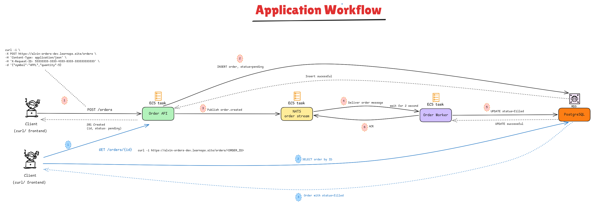

## Application Workflow

https://link.excalidraw.com/readonly/mOqlPFmteInCsRFvHMSo



---
## Local Setup

```
cp .env.example .env
```

```
docker build -t order-service:v0.1.0 .

docker network create order-network
docker volume create order-postgres-data
```

## Build Postgres
```
docker run -d \
  --name postgres \
  --network order-network \
  --env-file .env \
  --volume order-postgres-data:/var/lib/postgresql/data \
  --restart unless-stopped \
  --health-cmd='pg_isready -U "$POSTGRES_USER" -d "$POSTGRES_DB"' \
  --health-interval=2s \
  --health-timeout=3s \
  --health-retries=15 \
  postgres:16.9-alpine
```

Verify 
```
docker exec postgres \
  psql -U orders -d orders \
  -c "SELECT current_database(), current_user, version();"
  
 current_database | current_user |                                            version                                            
------------------+--------------+-----------------------------------------------------------------------------------------------
 orders           | orders       | PostgreSQL 16.9 on aarch64-unknown-linux-musl, compiled by gcc (Alpine 14.2.0) 14.2.0, 64-bit
(1 row)
```

---
## Start NATS with JetStream

```
docker volume create order-nats-data
```

```bash
docker run -d \
  --name nats \
  --network order-network \
  --volume order-nats-data:/data \
  --restart unless-stopped \
  --health-cmd='wget -q --spider "http://127.0.0.1:8222/healthz?js-enabled-only=true"' \
  --health-interval=2s \
  --health-timeout=3s \
  --health-retries=15 \
  nats:2.11.6-alpine \
  --jetstream \
  --store_dir=/data \
  --http_port=8222
```

---
## Run the migration

```
docker run --rm \
  --name order-migrate \
  --network order-network \
  --env-file .env \
  order-service:v0.1.0 \
  python -m app.migrate
```

```
order-service:v0.1.0
         |
         v
Temporary order-migrate container
         |
         | DATABASE_URL
         v
postgres container
         |
         v
Create schema_migrations table
         |
         v
Run 001_create_orders.sql
         |
         v
Create orders table
         |
         v
Container exits and is deleted
```
---
## Check the migration history
```
docker exec postgres \
  psql -U orders -d orders \
  -c "SELECT version, applied_at FROM schema_migrations;"
  
        version        |          applied_at           
-----------------------+-------------------------------
 001_create_orders.sql | 2026-07-21 18:26:21.231907+00
(1 row)
```


```
docker exec postgres \
  psql -U orders -d orders \
  -c "\d orders"
  
                                    Table "public.orders"
   Column   |           Type           | Collation | Nullable |           Default            
------------+--------------------------+-----------+----------+------------------------------
 id         | uuid                     |           | not null | 
 symbol     | character varying(32)    |           | not null | 
 quantity   | integer                  |           | not null | 
 status     | character varying(16)    |           | not null | 'pending'::character varying
 created_at | timestamp with time zone |           | not null | now()
 updated_at | timestamp with time zone |           | not null | now()
Indexes:
    "orders_pkey" PRIMARY KEY, btree (id)
    "orders_status_idx" btree (status)
Check constraints:
    "orders_quantity_check" CHECK (quantity > 0)
    "orders_status_check" CHECK (status::text = ANY (ARRAY['pending'::character varying, 'filled'::character varying]::text[]))
    "orders_symbol_check" CHECK (length(btrim(symbol::text)) > 0)
```

---
## Start the API Service

```
docker run -d \
  --name order-api \
  --network order-network \
  --env-file .env \
  --publish 127.0.0.1:8000:8000 \
  --restart unless-stopped \
  --health-cmd="python -c \"import urllib.request; urllib.request.urlopen('http://127.0.0.1:8000/health', timeout=2)\"" \
  --health-interval=5s \
  --health-timeout=3s \
  --health-retries=10 \
  --health-start-period=3s \
  order-service:v0.1.0 \
  python -m app.api_entrypoint
```

### What happens during API Startup
```
order-api container starts
          |
          v
Load environment variables
          |
          +------ connect to postgres
          |
          +------ connect to nats
          |
          v
Create or find ORDERS JetStream stream
          |
          v
Listen on container port 8000
```

### Liveness
```
curl -i http://localhost:8000/health
```

---
## Start the worker

```
docker run -d \
  --name order-worker \
  --network order-network \
  --env-file .env \
  --restart unless-stopped \
  --health-cmd="python -c \"import os; os.kill(1, 0)\"" \
  --health-interval=10s \
  --health-timeout=3s \
  --health-retries=3 \
  order-service:v0.1.0 \
  python -m app.worker
```

### What happens during worker startup
```
order-worker starts
        |
        v
Read values from .env
        |
        +---- connect to postgres
        |
        +---- connect to nats
        |
        v
Find or create ORDERS stream
        |
        v
Create/find durable consumer: orders-worker
        |
        v
Wait for messages on orders.created
```

---
##  Create an order

```bash
curl -i -X POST http://localhost:8000/orders \
  -H 'Content-Type: application/json' \                                 
  -H 'X-Request-ID: 22222222-2222-4222-8222-222222222222' \
  -d '{"symbol":"BTC","quantity":90000}'


HTTP/1.1 201 Created
date: Tue, 21 Jul 2026 18:42:54 GMT
server: uvicorn
content-length: 64
content-type: application/json
x-request-id: 22222222-2222-4222-8222-222222222222

{"id":"28ca4718-7795-43c8-ae7b-303f70b28980","status":"pending"}%                                                            
```

There are two IDs
```
Request ID:
22222222-2222-4222-8222-222222222222

Order ID:
the UUID returned in the JSON body
```

Retrieve the order
```
curl -i \
  http://localhost:8000/orders/YOUR-ORDER-ID
```

```
HTTP/1.1 200 OK
date: Tue, 21 Jul 2026 18:59:28 GMT
server: uvicorn
content-length: 178
content-type: application/json
x-request-id: 31975ce2-e710-4e8b-8012-69aba242a286

{"id":"28ca4718-7795-43c8-ae7b-303f70b28980","symbol":"AAPL","quantity":5,"status":"filled","created_at":"2026-07-21T18:42:55.553385Z","updated_at":"2026-07-21T18:42:57.567636Z"}%
```

Check in database
```
docker exec postgres \
  psql -U orders -d orders \
  -c "SELECT id, symbol, quantity, status, created_at, updated_at
      FROM orders"
      
                  id                  | symbol | quantity | status |          created_at           |          updated_at           
--------------------------------------+--------+----------+--------+-------------------------------+-------------------------------
 28ca4718-7795-43c8-ae7b-303f70b28980 | AAPL   |        5 | filled | 2026-07-21 18:42:55.553385+00 | 2026-07-21 18:42:57.567636+00
 3a0e830e-efa8-4ed3-831e-58edb9522b5f | BTC    |    90000 | filled | 2026-07-21 18:56:37.768193+00 | 2026-07-21 18:56:39.802481+00
(2 rows)
```

NATS Lifecycle
```
curl
  |
  | POST /orders
  v
order-api
  |
  +---- INSERT pending ----------> postgres
  |
  +---- publish orders.created --> nats
                                     |
                                     v
                               order-worker
                                     |
                                     | wait 2 seconds
                                     |
                                     +---- UPDATE filled --> postgres
```